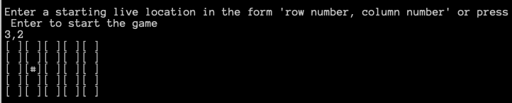

# Conway's Game of Life Kata  

The Game of Life, also known simply as Life, is a cellular automaton devised by the British mathematician John Horton Conway in 1970.  
The "game" is a zero-player game, meaning that its evolution is determined by its initial state, requiring no further input. One interacts with the Game of Life by creating an initial configuration and observing how it evolves.

## Rules of the game  
* The world is a 2D orthogonal grid of square cells
* Each cell has two states: living or dead
* Every cell has 8 neighbours. If the cells are at the boundary of the grid the neighbours laps over to the other side.

  

At each step in time (called a tick), the following transitions occur:  
* Any live cell with fewer than two live neighbours dies, as if caused by underpopulation.
* Any live cell with more than three live neighbours dies, as if by overcrowding.
* Any live cell with two or three live neighbours lives on to the next generation.
* Any dead cell with exactly three live neighbours becomes a live cell.  

  

## Kata Tasks

The task is to implement Conway’s Game of Life which meets these requirements:  
* Visualize the game in the console
* Be able to define how big the world/grid is (10x10, 50x80, etc.)
* Be able to set the initial state of the world

## Getting Started

### System Requirements

* A command line interface (CLI) such as ```Command Prompt``` for Windows or ```Terminal``` for macOS
* [.Net Core 3.1 SDK](https://dotnet.microsoft.com/download) or later.
If you have ```homebrew``` you can install the latest version of the .NET Core SDK by running the command ```brew cask install dotnet-sdk``` in the CLI

### Installation

1. Download the repository or clone to your computer using the ```git clone``` command
2. In the CLI, navigate into the folder containing the solution and enter ```dotnet restore``` to install the package dependencies
3. In the same folder, enter ```dotnet build``` to compile the projects

### Running the application
If using the CLI:
1. CD into the ```kata_conways_game_of_life``` project
2. Enter ```dotnet run Program.cs``` and press Enter to run

# Local Deployment

1. Enter ```dotnet publish``` in the CLI
2. To run the resultant application, navigate into the ```publish``` folder. The folder can be found within the ```bin``` directory. The path may be similar to this: ```<solution directory>/bin/Debug/netcoreapp3.1/publish```.
To run the published application, enter ```dotnet kata_conways_game_of_life.dll```

## Usage
1. Enter a whole number of at least 5 for the rows and press Enter. Repeat for and columns.
  
2. Enter a coordinate in the form x,y to specify a starting live cell location
  
3. Repeat step 2 to add additional coordinates
4. Press Enter to begin the game
5. The grid configuration will automatically update every second
6. Once all the cells are dead or no cells will change state at the next tick, the application will terminate.

## Unit tests

Using the CLI:
From the solution folder, enter ```dotnet test``` and press Enter to run the unit tests in the solution

### Cell Tests  
These tests checks that the state of a ```Cell``` object (dead or alive) is correct upon instantiation, death and revival.

### Location tests  
The location tests are used to check that each ```Location``` stores the correct state of the cell at the next tick (dead or alive). Per the game rules, each location's next cell state is dependent on how many surrounding live neighbours it has.

### Grid tests
The grid tests makes use of concrete ```Cell``` and ```Location``` objects to check that correct neighbours are used for each location to determine the next cell states.

### Game Tests  
The ```Game``` tests uses concrete ```Grid```, ```Location``` and ```Cell``` objects to test the interaction of these different classes together. The final grid display ```string``` is used to check that the game loop has been executed correctly and that the resultant grid configuration is correct when given a starting configuration. The starting configuration is obtained by using a Mock IInput object to specify the starting live locations. 

### Validator tests  
The ```Validator``` class methods returns a ```ValidationResult``` object to indicate if the input data is valid. If the parsed input is invalid, an error message will be stored. If the input is valid, the result will be stored. The validator tests are used to verify that the validator is returning either a result or error message as expected. 

### InputParser tests  
The ```InputParser``` class methods are used to parse input data from string to an integer array if the input coordinates are valid numbers. The tests are used to check that valid input can be parsed from string to integer, and if not, an exception is thrown.


## Dependencies

* [Figgle](https://www.nuget.org/packages/Figgle/) - Font package, installed via Nuget 
* [XUnit](https://xunit.net/) - Testing framework
* [Moq](https://github.com/Moq/moq4/wiki/Quickstart) - Mocking framework
